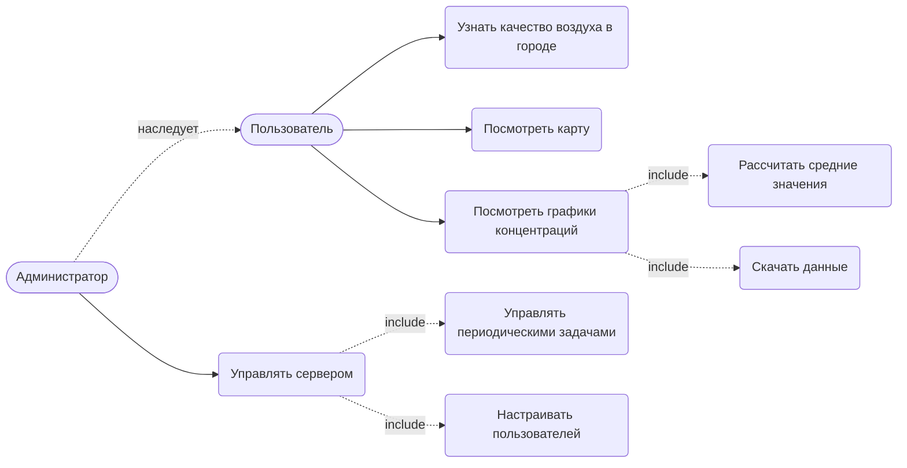
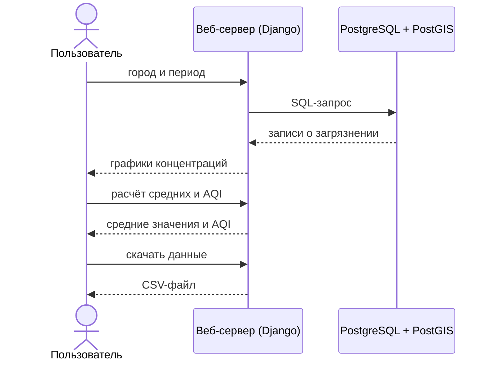
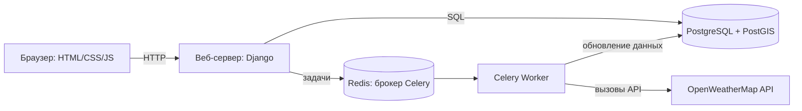

# UML-диаграммы «AirCheck»

## Варианты использования

```mermaid
flowchart LR
    U([Пользователь]) --> A(Узнать качество воздуха в городе)
    U --> B(Посмотреть карту)
    U --> C(Посмотреть графики концентраций)
    C -. include .-> D(Рассчитать средние значения)
    C -. include .-> E(Скачать данные)
    Adm([Администратор]) --> F(Управлять сервером)
    F -. include .-> G(Управлять периодическими задачами)
    F -. include .-> H(Настраивать пользователей)
    Adm -. наследует .-> U
```

## Последовательность: запрос данных по городу

```mermaid
sequenceDiagram
    actor П as Пользователь
    participant W as Веб-сервер (Django)
    participant DB as PostgreSQL + PostGIS
    П->>W: город и период
    W->>DB: SQL-запрос
    DB-->>W: записи о загрязнении
    W-->>П: графики концентраций
    П->>W: расчёт средних и AQI
    W-->>П: средние значения и AQI
    П->>W: скачать данные
    W-->>П: CSV-файл
```

## Развёртывание

```mermaid
flowchart LR
    Br[Браузер: HTML/CSS/JS] -- HTTP --> Web[Веб-сервер: Django]
    Web -- SQL --> DB[(PostgreSQL + PostGIS)]
    Web -- задачи --> R[(Redis: брокер Celery)]
    R --> Wk[Celery Worker]
    Wk -- обновление данных --> DB
    Wk -- вызовы API --> OW[OpenWeatherMap API]
```
